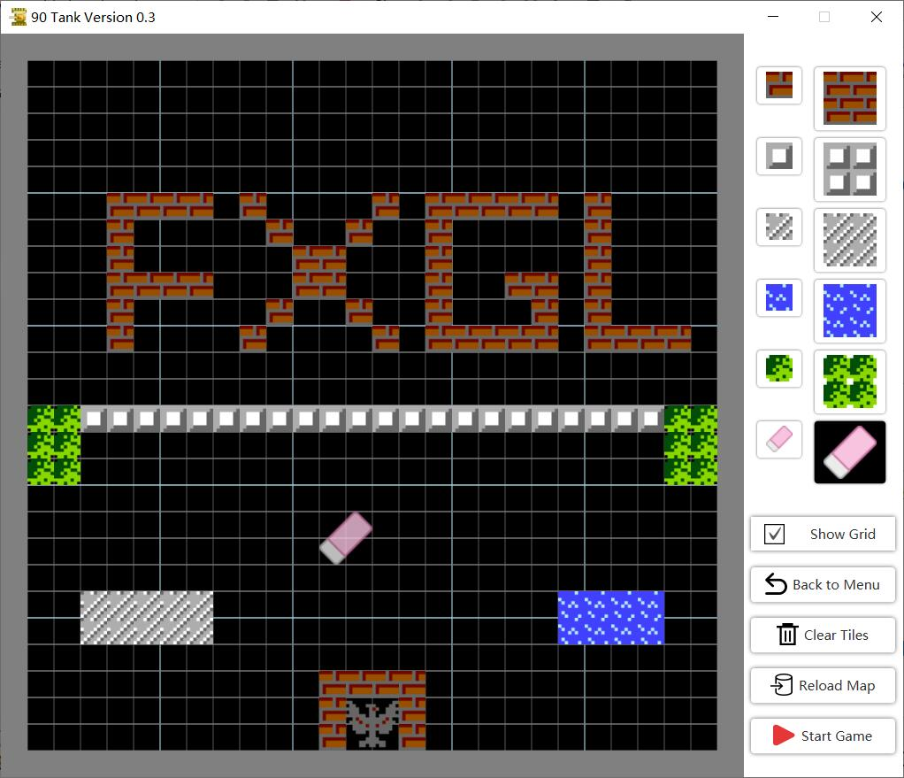

### Tank Game
> Powered by JavaFX & FXGL

> 本项目所使用的部分图片、音频及其他资源来自网络，仅用于 JavaFX 与 FXGL 技术的学习与研究；不作任何商业用途。
如有内容侵犯您的权益，请与我联系，我将及时予以删除。

> Certain images, audio files, and other resources included in this project were obtained from online sources.
This project is for educational and non-commercial purposes only (JavaFX / FXGL learning).
If you are the owner of any content used here and would like it removed, please contact me and I will promptly comply.

> Email: leewyatt7788@gmail.com

> 我的javafxQQ群: 715598051
> 目前的 加群问题: JavaFX是什么? 答: Java的图形界面框架

There are a variety of game props.

